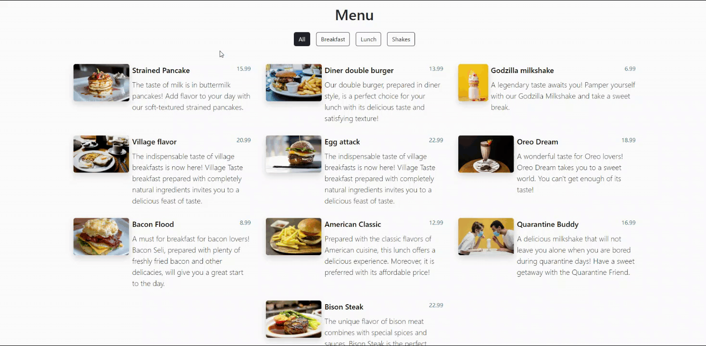

# QR Menu Project

This project is a QR code-based digital menu application for restaurants. Customers can access the digital menu and place orders by scanning the QR codes.

## Technologies Used

- **HTML**
- **CSS**
- **JavaScript**

## Preview

